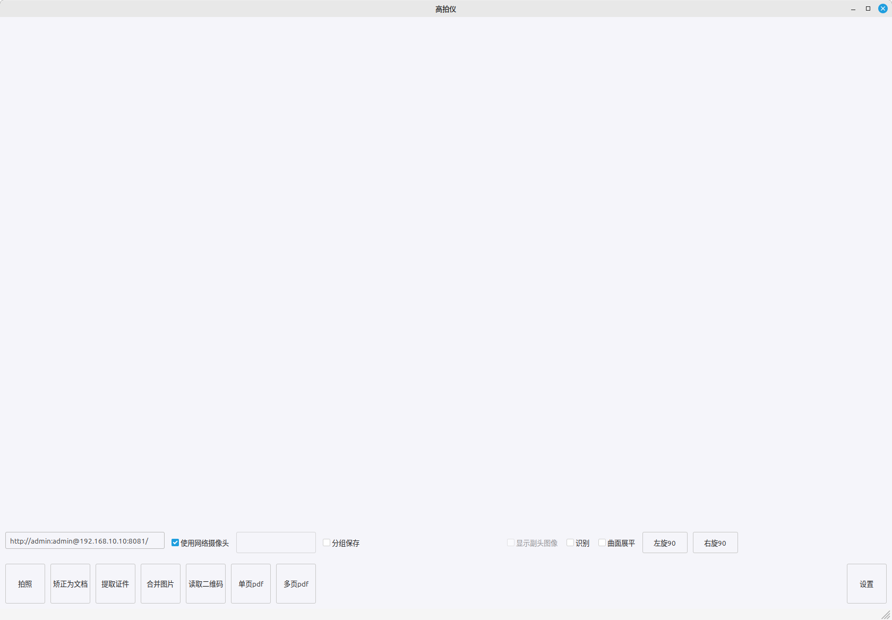
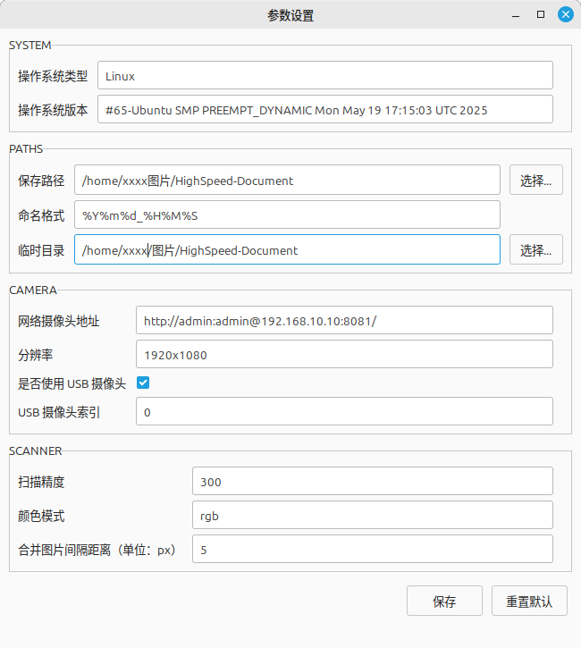

# 📄 HighSpeed-Document-Scanner

> 🚀 开源高拍仪桌面应用程序，支持多平台，基于 Python + OpenCV + wxPython。

- 支持卡证扫描、图像裁剪、倾斜矫正
- 自动保存 PDF 或图片
- 跨平台：Windows、Linux
- 开源、免费、可商用

---

## 🌟 功能特性

- ✅ 实时摄像头取图
- ✅ 支持多种高拍仪设备
- ✅ 图像自动裁剪、倾斜矫正
- ✅ 支持 JPG、PNG、PDF 导出
- ✅ 多页 PDF 合并
- ✅ 简洁、易用、快速启动
- ✅ 支持离线使用，无需联网

---

## 📸 软件界面

### 主界面



### 设置界面

---

## 🚀 快速开始

### 1️⃣ 克隆项目

```bash
git clone https://github.com/你的用户名/HighSpeed-Document-Scanner.git
cd HighSpeed-Document-Scanner
```

### 2️⃣ 安装依赖

```bash
pip install -r requirements.txt
```

### 3️⃣ 运行

```bash
python main_app.py
```

---

## 🏗️ 打包发布命令

### ✅ Nuitka 打包

```bash
time nuitka main_app.py  --mingw64  --standalone  --onefile  --show-progress  --windows-console-mode=disable  --include-module=wx._xml  --include-data-files=HighSpeed-Document-Scanner.png=.  --include-data-files=HighSpeed-Document-Scanner.ico=.  --include-data-dir=models=./models  --output-dir=nuitka_out
```

- ⏱️ 打包耗时：3分47秒
- 📦 文件体积：104.8MB

---

### ✅ PyInstaller 打包

```bash
time pyinstaller main_app.py   --onefile   --noconsole   --add-data="HighSpeed-Document-Scanner.png:."   --add-data="HighSpeed-Document-Scanner.ico:."   --add-data="models:models"   --hidden-import=wx._xml   --distpath out
```

- ⏱️ 打包耗时：43秒
- 📦 文件体积：151.7MB

---


## 📂 目录结构

```plaintext
├── main_app.py           # 主程序
├── utils.py              # 工具模块
├── models/               # 模型文件
│   └── cv_resnet18_card_correction.onnx
├── HighSpeed-Document-Scanner.ico
├── HighSpeed-Document-Scanner.png
├── requirements.txt      # Python依赖
├── README.md             # 本文件
```

---


## 🙌 鸣谢

- [wxPython](https://wxpython.org/)
- [OpenCV](https://opencv.org/)
- [cv_resnet18_card_correction-opencv-dnn](https://github.com/hpc203/cv_resnet18_card_correction-opencv-dnn)
- [读光-票证检测矫正模型](https://modelscope.cn/models/iic/cv_resnet18_card_correction)

---
## 📄 开源协议

本项目基于 [MIT License](LICENSE) 开源，完全免费，允许商用。


